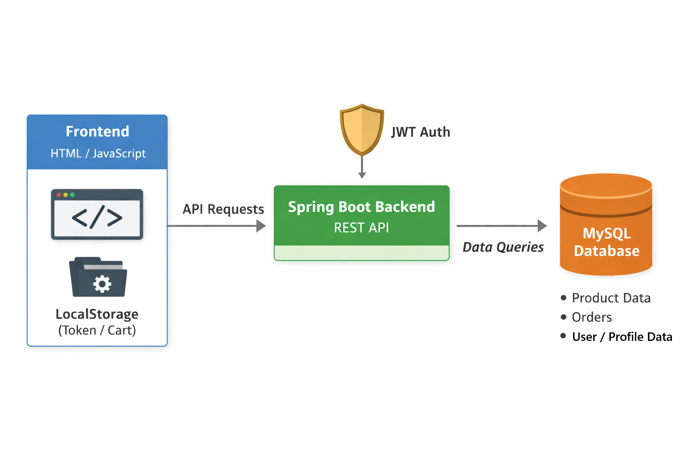
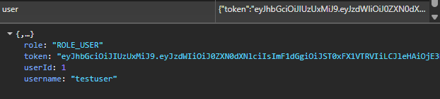
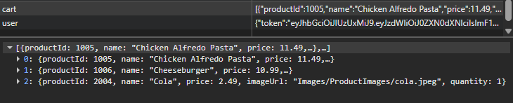
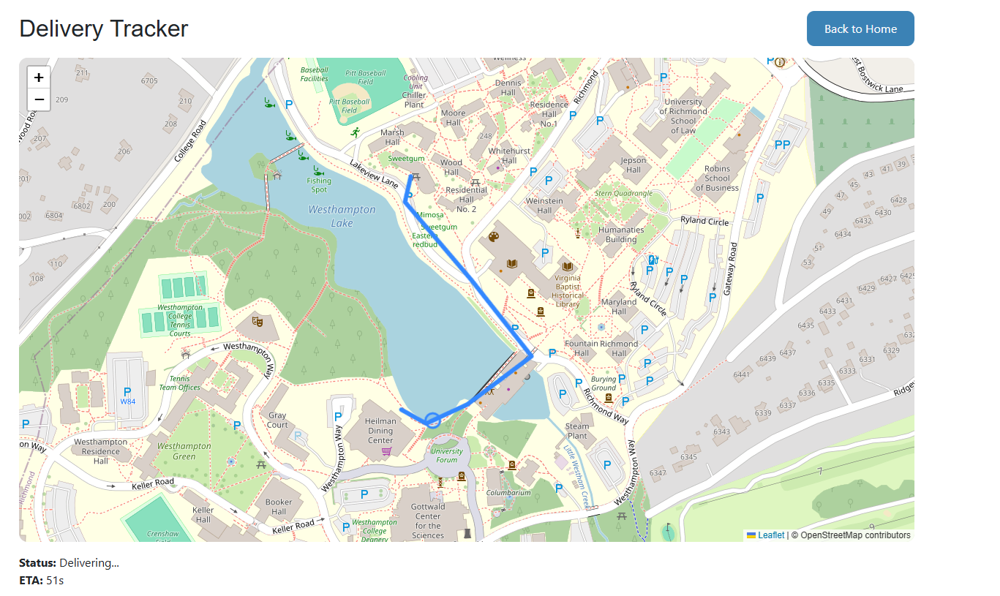
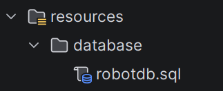
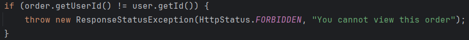

# 🤖 RoboDash

RoboDash is a full-stack web application that simulates autonomous robot food delivery.  
Users can register, log in, manage their profile, place food orders, and watch a robot deliver their order along a dynamically calculated route.

This project demonstrates real-world full-stack development concepts including authentication, REST APIs, database persistence, and algorithm-driven simulation.

---

## 🚀 Features

- User registration and login (JWT authentication)
- Secure, role-based protected endpoints
- Profile creation and editing
- Product browsing and cart system
- LocalStorage-based cart persistence
- Order placement and tracking
- Robot delivery simulation with animated routing
- Shortest-path routing using Dijkstra’s Algorithm
- Order status lifecycle:
    - `IN_PROGRESS` → `COMPLETE`

---

## 🛠️ Tech Stack

### Frontend
- HTML
- CSS / Bootstrap
- JavaScript
- Axios

### Backend
- Java Spring Boot
- Spring Security
- JWT Authentication (custom filter)

### Database
- MySQL

---

## 🧠 Architecture Overview

Frontend (HTML/JS + Axios) → 
Spring Boot REST API →
MySQL Database

### Key Concepts

- Frontend communicates with backend via REST endpoints
- JWT tokens are stored in `localStorage` and attached to requests
- A custom `JWTFilter` validates incoming requests
- Spring Security manages authentication and authorization
- Orders, users, and profiles are persisted in MySQL
- Robot routes are computed using Dijkstra’s Algorithm

---

## 🔐 Authentication Flow

1. User registers via `/register`
2. User logs in via `/login`
3. Backend returns a JWT token
4. Token is stored in `localStorage`
5. Token is sent in the `Authorization` header
6. Backend validates token using `JWTFilter`
7. Authenticated user is set in `SecurityContext`

---

## 🛒 Application Workflow

1. Register a new account
2. Log in
3. Update user profile
4. Browse products and add items to cart
5. Cart is stored in `localStorage`
6. Proceed to checkout and place order
7. Order is persisted in the database
8. Robot calculates shortest route and begins delivery
9. Order status updates from `IN_PROGRESS` to `COMPLETE`

---

## 🤖 Robot Delivery Simulation

- Each order triggers a delivery process
- The system calculates the shortest path between locations using Dijkstra’s Algorithm
- The robot visually traverses the route on the frontend
- Delivery progress is animated in real time
- Order status is updated upon completion

---

## ▶️ Getting Started

### Prerequisites

- Java (JDK 11+)
- MySQL
- Browser (Chrome recommended)

---

### Setup

1. Clone the repository

2. Create and configure your MySQL database (SQL script in resources package)

3. Update database credentials in `application.properties`

4. Run the Spring Boot application

5. Open the frontend:
   http://localhost:63342/robo-dash/RoboDash-Website/index.html

---

## 🔒 Security

- JWT-based authentication
- Protected endpoints using `@PreAuthorize`
- Custom `JWTFilter` validates tokens per request
- Frontend route guards redirect unauthorized users
- Authorization headers automatically attached via Axios
- Users may only view or modify their own orders

---

## ⚠️ Limitations

- Cart is stored in `localStorage` (not persisted server-side)
- Minimal frontend validation in some forms
- `state` field limited to 2 characters (e.g., "TX")
- Robot routing depends on predefined map data in database

---

## 🧠 Key Technical Highlights

- Custom JWT authentication filter integrated with Spring Security
- Role-based authorization (`ROLE_USER`)
- Full frontend ↔ backend integration using Axios
- Real-time simulation tied to backend state changes
- Algorithm-driven routing (Dijkstra’s Algorithm)

---

## 👨‍💻 Contributors

-   Humza Qasim
-   Michael Elliston
-   Shamar Mohammed
-   Zion Blue
-   Kigen Jones
-   Moussa Hassan
-   Mya Allen
-   Uriel Marrufo
-   Rosa Sifuentes

---

## 📌 Notes

This project was developed as part of a full-stack training program to demonstrate practical application of backend services, frontend integration, and system design principles.